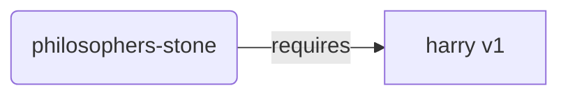
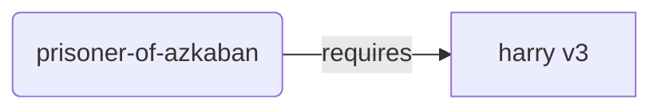
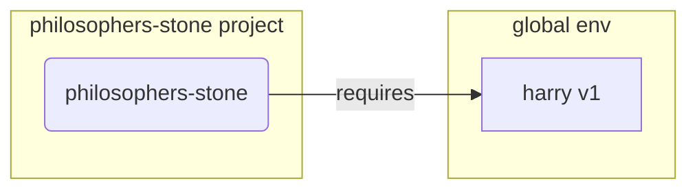
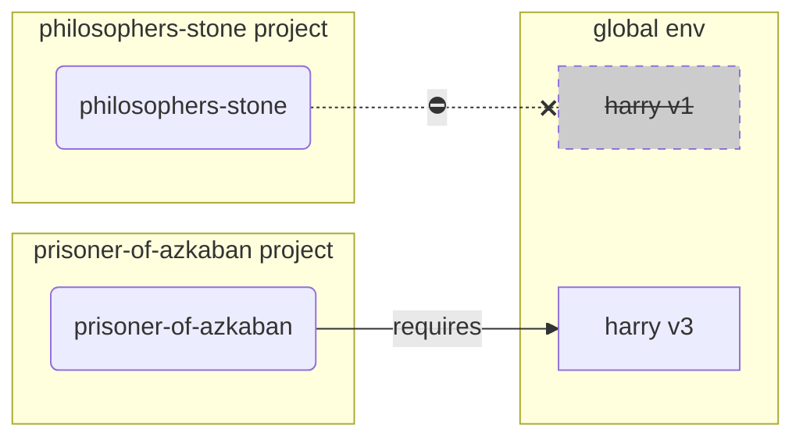
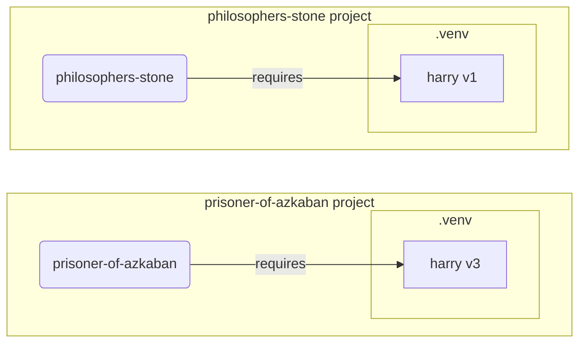

# 虚拟环境

当你在Python项目中工作时，你可能应该使用**虚拟环境**（或类似机制）来隔离每个项目安装的包。

/// info

如果你已经了解虚拟环境，知道如何创建和使用它们，你可能想跳过这一部分。🤓

///

/// tip

**虚拟环境**和**环境变量**是不同的。

**环境变量**是系统中的一个变量，程序可以使用它。

**虚拟环境**是一个包含一些文件的目录。

///

/// info

这一页将教你如何使用**虚拟环境**以及它们的工作原理。

如果你准备好使用一个**管理一切的工具**（包括安装Python），可以尝试 <a href="https://github.com/astral-sh/uv" class="external-link" target="_blank">uv</a>。

///

## 创建项目

首先，为你的项目创建一个目录。

我通常在我的 home/user 目录下创建一个名为 `code` 的目录。

然后在其中为每个项目创建一个目录。

<div class="termy">

```console
// 转到主目录
$ cd
// 创建一个用于存放所有代码项目的目录
$ mkdir code
// 进入该代码目录
$ cd code
// 为这个项目创建一个目录
$ mkdir awesome-project
// 进入该项目目录
$ cd awesome-project
```

</div>

## 创建虚拟环境

当你**第一次**开始一个Python项目时，创建一个虚拟环境**<abbr title="有其他选项，这只是一个简单的指导">在你的项目中</abbr>**。

/// tip

你**每个项目**只需要做这一次，而不是每次工作都要这样做。

///

//// tab | `venv`

要创建一个虚拟环境，你可以使用Python自带的 `venv` 模块。

<div class="termy">

```console
$ python -m venv .venv
```

</div>

/// details | 该命令的含义

* `python`: 使用名为 `python` 的程序
* `-m`: 作为脚本调用一个模块，我们将在下一个参数中告诉它是哪个模块
* `venv`: 使用名为 `venv` 的模块，它通常随Python一起安装
* `.venv`: 在名为 `.venv` 的新目录中创建虚拟环境

///

////

//// tab | `uv`

如果你安装了 <a href="https://github.com/astral-sh/uv" class="external-link" target="_blank">`uv`</a>，你可以使用它来创建虚拟环境。

<div class="termy">

```console
$ uv venv
```

</div>

/// tip

默认情况下，`uv` 会在名为 `.venv` 的目录中创建虚拟环境。

但你可以通过传递一个额外的参数自定义目录名称。

///

////

该命令将在名为 `.venv` 的目录中创建一个新的虚拟环境。

/// details | `.venv` 或其他名称

你可以在不同的目录中创建虚拟环境，但有一个约定是将其命名为 `.venv`。

///

## 激活虚拟环境

激活新的虚拟环境，这样你运行的任何Python命令或安装的包都会使用它。

/// tip

每次你在项目上开始一个**新的终端会话**时都要这样做。

///

//// tab | Linux, macOS

<div class="termy">

```console
$ source .venv/bin/activate
```

</div>

////

//// tab | Windows PowerShell

<div class="termy">

```console
$ .venv\Scripts\Activate.ps1
```

</div>

////

//// tab | Windows Bash

如果你使用Windows的Bash（例如 <a href="https://gitforwindows.org/" class="external-link" target="_blank">Git Bash</a>）：

<div class="termy">

```console
$ source .venv/Scripts/activate
```

</div>

////

/// tip

每次你在该环境中安装一个**新包**时，**再次激活**环境。

这确保了如果你使用的是该包安装的**终端（<abbr title="命令行界面">CLI</abbr>）程序**，你将使用来自虚拟环境的那个，而不是任何其他可能全局安装的，可能与你需要的版本不同的版本。

///

## 检查虚拟环境是否激活

检查虚拟环境是否激活（前一个命令是否有效）。

/// tip

这**可选**，但它是一个**检查**是否一切按预期工作并且你正在使用你意图的虚拟环境的好方法。

///

//// tab | Linux, macOS, Windows Bash

<div class="termy">

```console
$ which python

/home/user/code/awesome-project/.venv/bin/python
```

</div>

如果它显示 `.venv/bin/python` 中的 `python` 二进制文件，位于你的项目中（在这个例子中是 `awesome-project`），那么它就工作了。🎉

////

//// tab | Windows PowerShell

<div class="termy">

```console
$ Get-Command python

C:\Users\user\code\awesome-project\.venv\Scripts\python
```

</div>

如果它显示 `.venv\Scripts\python` 中的 `python` 二进制文件，位于你的项目中（在这个例子中是 `awesome-project`），那么它就工作了。🎉

////

## 升级 `pip`

/// tip

如果你使用 <a href="https://github.com/astral-sh/uv" class="external-link" target="_blank">`uv`</a>，你将使用它来安装东西，而不是 `pip`，因此你不需要升级 `pip`。😎

///

如果你使用 `pip` 来安装包（它默认随Python一起安装），你应该**升级**到最新版本。

安装包时遇到的许多奇怪错误可以通过首先升级 `pip` 来解决。

/// tip

你通常**只需要做一次**，就在创建虚拟环境之后。

///

确保虚拟环境已激活（使用上面的命令），然后运行：

<div class="termy">

```console
$ python -m pip install --upgrade pip

---> 100%
```

</div>

## 添加 `.gitignore`

如果你使用 **Git**（你应该这样做），添加一个 `.gitignore` 文件来排除Git中的 `.venv` 中的所有内容。

/// tip

如果你使用 <a href="https://github.com/astral-sh/uv" class="external-link" target="_blank">`uv`</a> 来创建虚拟环境，它已经为你做了这个步骤，你可以跳过。😎

///

/// tip

创建虚拟环境之后，**只需要做一次**。

///

<div class="termy">

```console
$ echo "*" > .venv/.gitignore
```

</div>

/// details | 该命令的含义

* `echo "*"`: 将文本 `*` "打印" 在终端上（下一部分会稍作改变）
* `>`: 左边命令在终端打印的任何内容都不应该打印出来，而是写入右边的文件
* `.gitignore`: 要写入文本的文件名称

`*` 对于Git来说意味着 "所有内容"。因此，它将忽略 `.venv` 目录中的所有内容。

该命令将创建一个 `.gitignore` 文件，内容如下：

```gitignore
*
```

///

## 安装包

激活环境后，你可以在其中安装包。

/// tip

安装或升级项目所需的包时**只需做一次**。

如果你需要升级版本或添加新包，你**可以再次执行此操作**。

///

### 直接安装包

如果你很着急，不想使用文件来声明项目的包需求，你可以直接安装它们。

/// tip

将你的程序需要的包和版本放在一个文件中（例如 `requirements.txt` 或 `pyproject.toml`）是个（非常）好主意。

///

//// tab | `pip`

<div class="termy">

```console
$ pip install "fastapi[standard]"

---> 100%
```

</div>

////

//// tab | `uv`

如果你有 <a href="https://github.com/astral-sh/uv" class="external-link" target="_blank">`uv`</a>：

<div class="termy">

```console
$ uv pip install "fastapi[standard]"
---> 100%
```

</div>

////

### 从 `requirements.txt` 安装

如果你有一个 `requirements.txt`，你现在可以用它来安装里面的包。

//// tab | `pip`

<div class="termy">

```console
$ pip install -r requirements.txt
---> 100%
```

</div>

////

//// tab | `uv`

如果你有 <a href="https://github.com/astral-sh/uv" class="external-link" target="_blank">`uv`</a>：

<div class="termy">

```console
$ uv pip install -r requirements.txt
---> 100%
```

</div>

////

/// details | `requirements.txt`

一个包含一些包的`requirements.txt` 文件可能看起来像这样：

```requirements.txt
fastapi[standard]==0.113.0
pydantic==2.8.0
```

///

## 运行你的程序

激活虚拟环境后，你可以运行你的程序，它将使用虚拟环境中的 Python 和你安装的包。

<div class="termy">

```console
$ python main.py

Hello World
```

</div>

## 配置你的编辑器

你可能会使用一个编辑器，确保你配置它使用你创建的虚拟环境（它可能会自动检测到），以便你获得自动补全和内联错误提示。

例如：

* <a href="https://code.visualstudio.com/docs/python/environments#_select-and-activate-an-environment" class="external-link" target="_blank">VS Code</a>
* <a href="https://www.jetbrains.com/help/pycharm/creating-virtual-environment.html" class="external-link" target="_blank">PyCharm</a>

/// tip

你通常只需要在**创建虚拟环境时做一次**。

///

## 停用虚拟环境

当你完成项目的工作后，你可以**停用**虚拟环境。

<div class="termy">

```console
$ deactivate
```

</div>

这样，当你运行 `python` 时，它将不会尝试使用虚拟环境中的 Python 和已安装的包。

## 准备工作

现在你已准备好开始你的项目工作。

/// tip

你想了解上面所有内容的原理吗？

继续阅读。👇🤓

///

## 为什么要使用虚拟环境

要使用 FastAPI，你需要安装 <a href="https://www.python.org/" class="external-link" target="_blank">Python</a>。

之后，你需要安装 FastAPI 和你想要使用的其他**包**。

要安装包，你通常会使用 Python 附带的 `pip` 命令（或类似的替代方案）。

然而，如果你直接使用 `pip`，这些包会安装在你的**全局 Python 环境**中（即全局安装的 Python）。

### 问题是什么

那么，将包安装在全局 Python 环境中会带来什么问题？

最终，你可能会编写许多不同的程序，它们依赖于**不同的包**。你参与的某些项目可能依赖于**同一个包的不同版本**。😱

例如，你可以创建一个名为 `philosophers-stone` 的项目，该程序依赖于另一个名为 **`harry` 的包，版本为 `1`**。所以，你需要安装 `harry`。



然后，稍后你创建另一个名为 `prisoner-of-azkaban` 的项目，该项目也依赖于 `harry`，但它需要**`harry` 版本 `3`**。



现在的问题是，如果你在全局环境中安装包（而不是在本地**虚拟环境**中），你将不得不选择安装哪个版本的 `harry`。

如果你想运行 `philosophers-stone`，你将需要首先安装 `harry` 版本 `1`，例如使用：

<div class="termy">

```console
$ pip install "harry==1"
```

</div>

然后你将得到 `harry` 版本 `1`，并将其安装在全局 Python 环境中。



但如果你想运行 `prisoner-of-azkaban`，你将需要卸载 `harry` 版本 `1`，并安装 `harry` 版本 `3`（或者只要安装版本 `3` 就会自动卸载版本 `1`）。

<div class="termy">

```console
$ pip install "harry==3"
```

</div>

然后你将得到 `harry` 版本 `3`，并将其安装在全局 Python 环境中。

如果你再次尝试运行 `philosophers-stone`，它可能**无法正常工作**，因为它需要 `harry` 版本 `1`。



/// tip

Python 包通常会尽量避免在**新版本**中引入**破坏性更改**，但为了安全起见，最好有意地安装新版本，并在你可以运行测试以确保一切正常时进行更新。

///

现在，想象一下你所有的项目依赖于**许多其他包**，管理这些包将会非常困难。最终你可能会遇到某些项目运行不兼容版本的包，而你却不知道为什么某些东西无法正常工作。

此外，取决于你的操作系统（例如 Linux、Windows、macOS），它可能已经安装了 Python。在这种情况下，系统可能已经预装了一些特定版本的包，这些包**是系统所需的**。如果你在全局 Python 环境中安装包，你可能会导致一些系统自带的程序**崩溃**。

## 包安装在哪里

当你安装Python时，它会在你的计算机中创建一些包含文件的目录。

其中一些目录负责存放你安装的所有包。

当你运行以下命令时：

<div class="termy">

```console
// 不要现在运行这个，它只是一个示例 🤓
$ pip install "fastapi[standard]"
---> 100%
```

</div>

该命令将从 <a href="https://pypi.org/project/fastapi/" class="external-link" target="_blank">PyPI</a> 下载一个压缩文件，其中包含FastAPI的代码。

它还会**下载**FastAPI依赖的其他包的文件。

然后，它会**解压缩**所有这些文件，并将它们放在你的计算机的某个目录中。

默认情况下，它会将这些下载并解压缩的文件放在你Python安装附带的目录中，这就是**全局环境**。

## 什么是虚拟环境

解决在全局环境中安装所有包的问题的方法是为你正在处理的每个项目使用**虚拟环境**。

虚拟环境是一个**目录**，它与全局目录非常相似，你可以在其中为某个项目安装包。

这样，每个项目都会有自己的虚拟环境（`.venv` 目录）和它自己的包。



## 激活虚拟环境意味着什么

当你激活一个虚拟环境时，例如使用：

//// tab | Linux, macOS

<div class="termy">

```console
$ source .venv/bin/activate
```

</div>

////

//// tab | Windows PowerShell

<div class="termy">

```console
$ .venv\Scripts\Activate.ps1
```

</div>

////

//// tab | Windows Bash

如果你使用Windows的Bash（例如 <a href="https://gitforwindows.org/" class="external-link" target="_blank">Git Bash</a>）：

<div class="termy">

```console
$ source .venv/Scripts/activate
```

</div>

////

该命令将创建或修改一些[环境变量](environment-variables.md){.internal-link target=_blank}，这些变量将用于接下来的命令。

其中一个变量是 `PATH` 变量。

/// tip

你可以在[环境变量](environment-variables.md#path-environment-variable){.internal-link target=_blank}部分了解更多关于 `PATH` 环境变量的内容。

///

激活虚拟环境后，虚拟环境会将它的路径 `.venv/bin`（在 Linux 和 macOS 上）或 `.venv\Scripts`（在 Windows 上）添加到 `PATH` 环境变量中。

假设在激活环境之前，`PATH` 变量看起来像这样：

//// tab | Linux, macOS

```plaintext
/usr/bin:/bin:/usr/sbin:/sbin
```

这意味着系统会在以下目录中查找程序：

* `/usr/bin`
* `/bin`
* `/usr/sbin`
* `/sbin`

////

//// tab | Windows

```plaintext
C:\Windows\System32
```

这意味着系统会在以下目录中查找程序：

* `C:\Windows\System32`

////

激活虚拟环境后，`PATH` 变量将类似于以下内容：

//// tab | Linux, macOS

```plaintext
/home/user/code/awesome-project/.venv/bin:/usr/bin:/bin:/usr/sbin:/sbin
```

这意味着系统现在会首先在以下目录中查找程序：

```plaintext
/home/user/code/awesome-project/.venv/bin
```

然后才会在其他目录中查找。

因此，当你在终端中键入 `python` 时，系统将找到位于：

```plaintext
/home/user/code/awesome-project/.venv/bin/python
```

的 Python 程序并使用它。

////

//// tab | Windows

```plaintext
C:\Users\user\code\awesome-project\.venv\Scripts;C:\Windows\System32
```

这意味着系统现在会首先在以下目录中查找程序：

```plaintext
C:\Users\user\code\awesome-project\.venv\Scripts
```

然后才会在其他目录中查找。

因此，当你在终端中键入 `python` 时，系统将找到位于：

```plaintext
C:\Users\user\code\awesome-project\.venv\Scripts\python
```

的 Python 程序并使用它。

////

一个重要的细节是，它会将虚拟环境的路径放在 `PATH` 变量的**最前面**。系统会首先找到它，因此当你运行 `python` 时，它将使用虚拟环境中的 Python，而不是任何其他全局环境中的 `python`。

激活虚拟环境还会更改其他一些设置，但这是最重要的一个。

## 检查虚拟环境是否激活

你可以通过以下命令检查虚拟环境是否激活：

//// tab | Linux, macOS, Windows Bash

<div class="termy">

```console
$ which python

/home/user/code/awesome-project/.venv/bin/python
```

</div>

////

//// tab | Windows PowerShell

<div class="termy">

```console
$ Get-Command python

C:\Users\user\code\awesome-project\.venv\Scripts\python
```

</div>

////

这意味着虚拟环境中的 `python` 程序正在被使用。

在 Linux 和 macOS 上，你使用 `which` 命令，在 Windows PowerShell 上，你使用 `Get-Command`。

这个命令的工作原理是，它会在 `PATH` 环境变量中检查，并按照顺序依次查找名为 `python` 的程序。一旦找到，它会**显示该程序的路径**。

最重要的是，当你调用 `python` 时，那个路径的 "`python`" 就是实际被执行的。

因此，你可以确认你是否在正确的虚拟环境中。

/// tip

很容易激活一个虚拟环境，获取一个 Python，然后**切换到另一个项目**。

如果你不小心，这时第二个项目可能**无法工作**，因为你使用的是**另一个项目的 Python**。

能够检查正在使用的 `python` 是哪个是非常有用的功能。🤓

///

## 为什么要停用虚拟环境

例如，你可能正在开发一个名为 `philosophers-stone` 的项目，**激活该虚拟环境**，安装包，并使用该环境进行工作。

然后你想要继续开发**另一个项目** `prisoner-of-azkaban`。

你切换到该项目：

<div class="termy">

```console
$ cd ~/code/prisoner-of-azkaban
```

</div>

如果你没有停用 `philosophers-stone` 的虚拟环境，当你在终端中运行 `python` 时，它会尝试使用 `philosophers-stone` 项目的 Python。

<div class="termy">

```console
$ cd ~/code/prisoner-of-azkaban

$ python main.py

// 无法导入 sirius，它未被安装 😱
Traceback (most recent call last):
    File "main.py", line 1, in <module>
        import sirius
```

</div>

但如果你停用了 `philosophers-stone` 的虚拟环境并激活了 `prisoner-of-azkaban` 的虚拟环境，那么当你运行 `python` 时，它将使用 `prisoner-of-azkaban` 虚拟环境中的 Python。

<div class="termy">

```console
$ cd ~/code/prisoner-of-azkaban

// 你不需要在旧目录中停用虚拟环境，可以在任何地方停用，甚至在切换到其他项目之后 😎
$ deactivate

// 激活 prisoner-of-azkaban/.venv 中的虚拟环境 🚀
$ source .venv/bin/activate

// 现在当你运行 python 时，它会找到安装在这个虚拟环境中的 sirius 包 ✨
$ python main.py

I solemnly swear 🐺
```

</div>

## 替代方案

这是一个帮助你入门并教你底层工作原理的简单指南。

有很多管理虚拟环境、包依赖（需求）、项目的**替代方案**。

一旦你准备好并且想要使用一个工具来**管理整个项目**、包依赖、虚拟环境等，我建议你尝试 <a href="https://github.com/astral-sh/uv" class="external-link" target="_blank">uv</a>。

`uv` 可以做很多事情，它可以：

* **为你安装 Python**，包括不同的版本
* 管理你项目的**虚拟环境**
* 安装**包**
* 管理项目的包**依赖和版本**
* 确保你有一个**确切的**包和版本的集合可以安装，包括它们的依赖项，这样你可以确保在生产环境中运行项目时与你在开发时的环境完全相同，这称为**锁定**
* 以及许多其他功能

## 结论

如果你读完并理解了所有内容，现在**你比许多开发者更了解**虚拟环境了。🤓

了解这些细节很可能在将来调试一些看似复杂的问题时派上用场，因为你会知道**底层原理是如何工作的**。😎